## Vivado Platform creation for Vitis accelerated flow
After this tutorial step you will have created the XSA file for the MYIR board.

The starting point is a Ubuntu 20.04 machine (real or virtual) with Xilinx tools release 2021.2 installed.

Your folder structure may vary, mine is:

```
~
|-- workspace
        |-- petalinux
        |-- vitis
        |-- vivado
```

And inside of these three folders we will generate project folders for each step of this tutorial. Other people prefer a single project folder with subfolders for each tool. Is just a different arrangement.

Let's start.

1. Start Vivado and create project

    Run vivado either on the terminal (in ~/workspace/vivado) or with the desktop shortcut.

    Click on **Create Project**
    
    Type **myir** as the project name and tick the option **Create project subdirectory**
    
    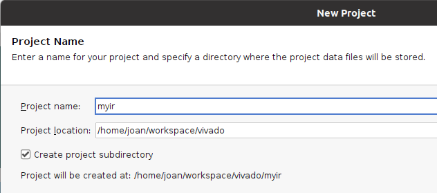
    
    Click **Next**. Select an RTL project and tick the **Project is an extensible Vitis platform** option
    
    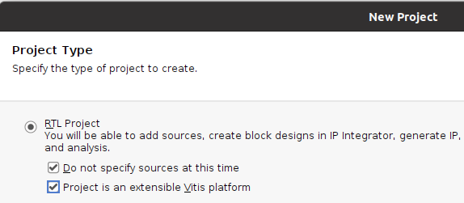
    
    Click **Next**. Now select the board. 
    
    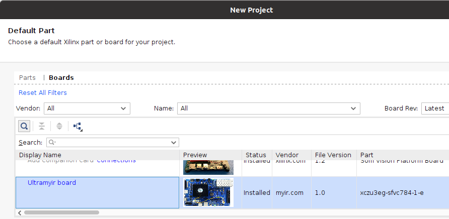
    
    If you don't have the MYIR board installed, just select the part (xczu3eg-sfvc784-1-e)
    
    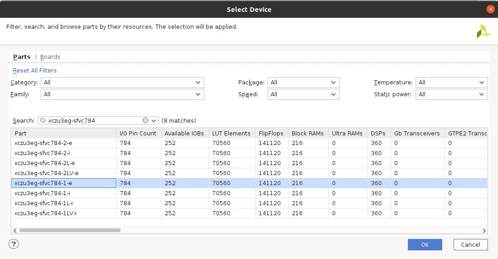
    
    Click **Finish**. A new blank project should be created.

2. Create and populate the block diagram
    
    In Vivado Flow Navigator, click on **Create Block Design** and name it **bd** 
    
    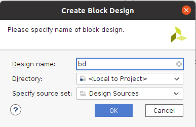
    
    In the created block diagram, click on the plus sign and add a Zynq Ultrascale+ MPSoC core
    
    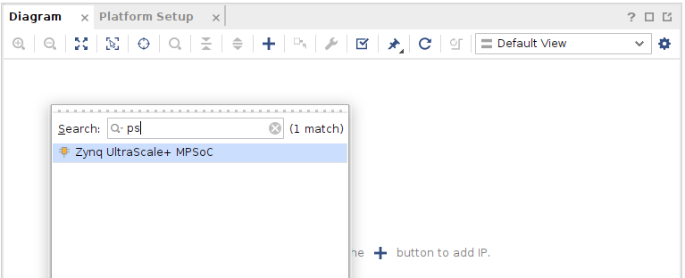
    
    Then double click on it to configure. Click on **Presets > Apply Configuration**
    
    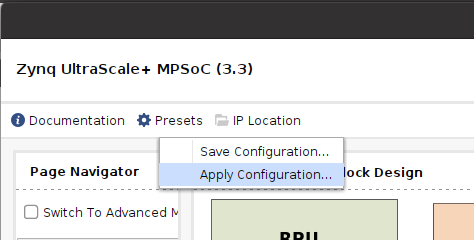
    
    Browse for the configuration file (umyir_ps_config.tcl) that is included in this repository.
    
    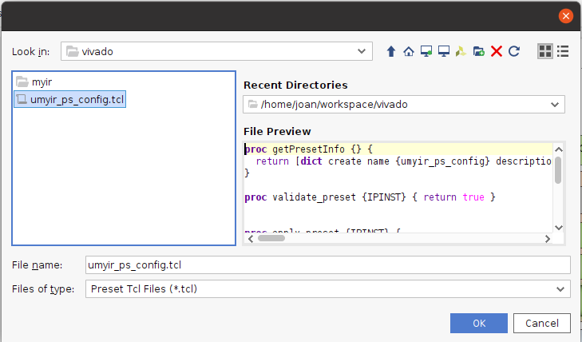
    
    After the preset is applied, in the **Clock configuration** tab, select **Output clocks** and disable PL1, leave only PL0 at 100 MHz.
    
    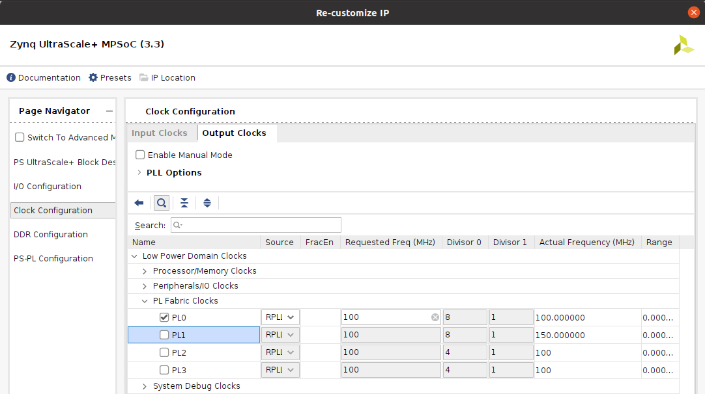
    
    In the **PS-PL Configuration** tab, disable all Master and Slave AXI ports
    
    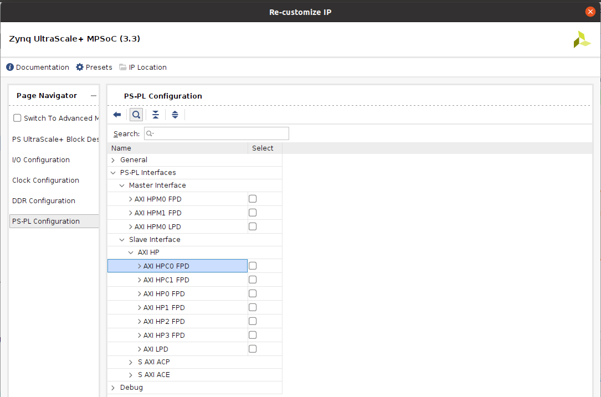
    
    Click **OK**. Then add the following IPs:
    
    - Clocking wizard. Configure it for three outputs at 100, 200 and 400 MHz. Change the reset input to active low. Leave the locked output.
    - Concat. Change it to one input port.
    - Processor System Reset (x 3)

    Connect them as shown below.
    
    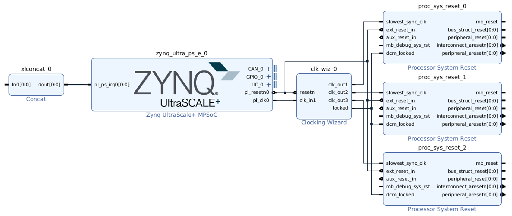
    
    Next is to configure the platform. In the **Platform Setup** tab in the block diagram, select the AXI ports as in the picture. Type names for the slave ports.
    
    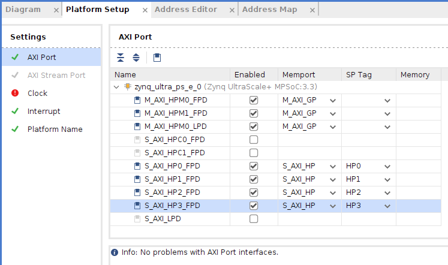
    
    Now select all three clocks from the wizard to be used by vitis and select the 200 MHz clock as default.
    
    
    
    Select interrupts 0 to 7 and enable them to be used by Vitis.
    
    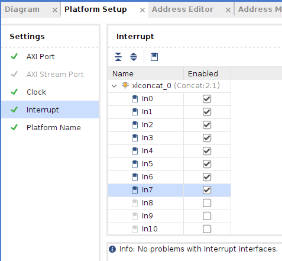
    
    Finally add the platform details.
    
    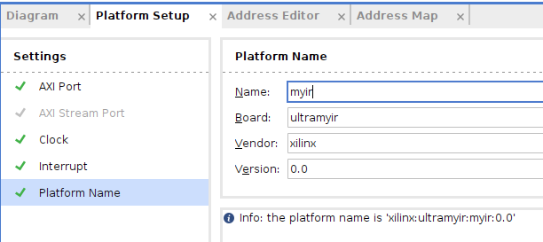
    
    Now save the platform and click on **Generate Block Design** on the Flow Navigator. Select **Global** as Synthesis option and click **Generate**
    
    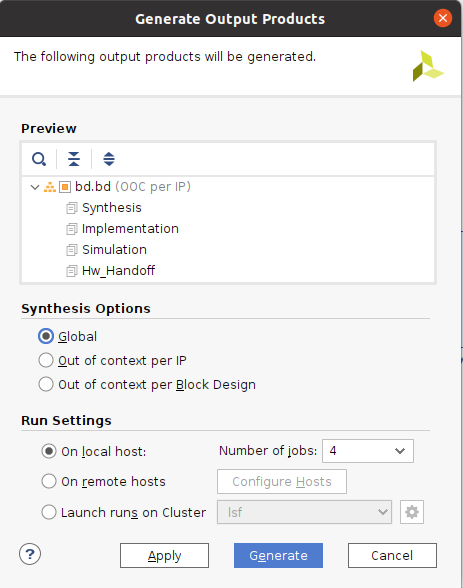
    
    Once it's done, right click on the block diagram icon in the Sources panel and select **Create HDL wrapper**. Select the option **Let Vivado manage wrapper and auto-update** and click **OK**.
    
    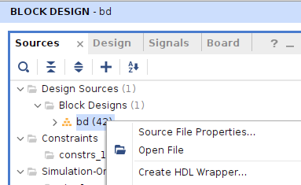
    
    Now click on **Generate Bitstream** on the Flow Navigator panel.
    
    When the bitstream is created, click on **Export Platform** and select the **Hardware** option.
    
    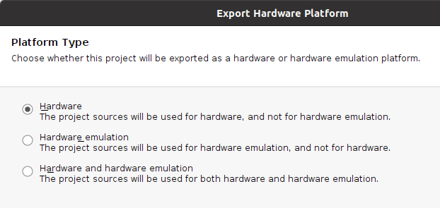
    
    Next, select the **Pre-Synthesis** platform state and make sure the **Include bitstream** box is ticked.
    
    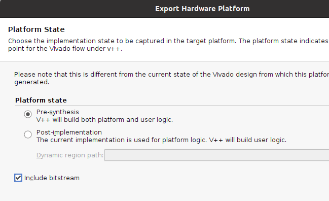
    
    Next, review the platform details, name, version, etc.
    
    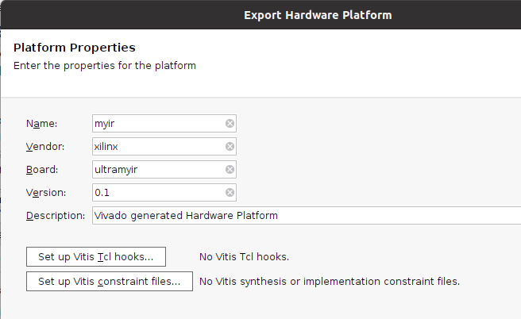
    
    Now choose a name and directory for the XSA file to create. Here I chose **myir_platform** and the ~/workspace/vivado/myir folder
    
    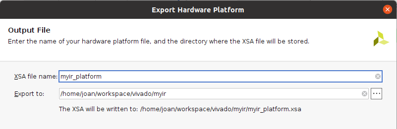

    Click **Finish**. After it's done, the XSA file will appear in the myir project folder.
    
    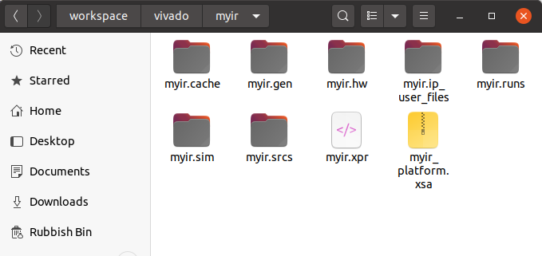
    
We have now completed the first step. Copy the myir_platform.xsa file to the workspace/petalinux folder to use it in [step 2](../07 step 2/)
