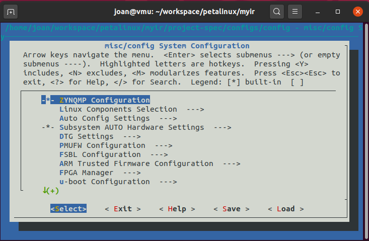
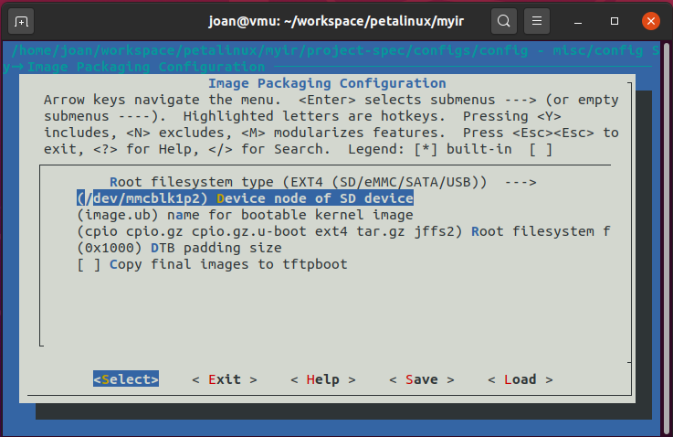
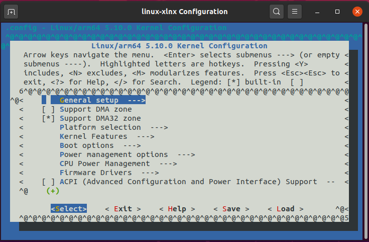
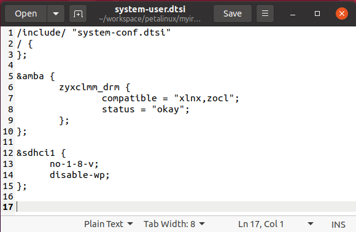

# Petalinux creation for Vitis accelerated flow with MYIR board

Here I assume you have completed <a href="https://github.com/Akteevy/UltraMYIR/tree/master/07 Vitis accelerated flow tutorial/07 step 1/">step 1</a> or have an XSA file for an extensible Vitis platform.

A reminder of the folder structure I use in a machine with Ubuntu 20.04 and Xilinx tools release 2021.2:

```
~
|-- workspace
        |-- petalinux
        |-- vitis
        |-- vivado
```

I assume the XSA file is in the `~/workspace/petalinux`  folder.


1. Project creation and general configuration
  
   Open a terminal in the petalinux folder and create the project:
   
   ```
   petalinux-create -t project -n myir --template zynqMP
   ```
   
   Enter that directory and configure the project with the XSA. If your XSA is somewhere else, just enter the correct path. 
   
   ```
   petalinux-config --get-hw-description=../
   ```
   
   The main configuration menu opens. 
   
   
   
   - Navigate to **DTG Settings** and enable **Remove PL from Devicetree**

     Note: I had trouble building Petalinux for extensible Vitis platforms with 2021.2 tools and found that to work but have not seen it documented elsewhere.
     
   - Navigate to **DTG Settings -> Kernel Bootargs** and disable **generate bootargs automatically**
   
   And enter the following bootargs:
   
   ```
   earlycon clk_ignore_unused root=/dev/mmcblk1p2 rootfstype=ext4 rw rootwait cma=512M
   ```
   
   - In **Image Package Configuration** change the **Root filesystem type** to EXT4 and set the **Device node of SD device** to /dev/mmcblk1p2
   
   - In **Image Package Configuration** disable the option **Copy final images to tftpboot**. Optional, this is just because I don't boot via tftp.
   
   
   
   The following settings are to use the cache sstate that builds much faster. Installing the cache sstate is not explained in this tutorial. If you don't have them installed, ignore the settings below. If you have them installed then the paths may differ from those below and you should know where you installed them.
   
   - In **Yocto Settings->Add pre-mirror url**, set it to  file:///tools/Xilinx/PetaLinux/2021.2/downloads
   
   - In **Yocto Settings->local sstate feeds settings**, set it to /tools/Xilinx/PetaLinux/2021.2/sstate_aarch64_2021.2/aarch64
   
   - In **Yocto Settings**, enable **ENABLE BB_NO_NETWORK**
   
   Exit and save the configuration.

2. Kernel configuration
   Configure the kernel with
   
   ```
   petalinux-config -c kernel
   ```
   
   
   
   - Navigate to **CPU power management->CPU Idle** and disable **CPU idle PM support**
   
   - Navigate to **CPU power management->CPU frequency scaling** and disable **CPU frequency scaling**
   
   - Navigate to **Library routines** and change **Size in Mega Bytes** to 1024
   
3. Customize the device tree
   
   Open the file `system-user.dtsi` in `~/workspace/petalinux/myir/project-spec/meta-user/recipes-bsp/device-tree/files` and paste the following content
   
   ```
   /include/ "system-conf.dtsi"
   / {
   };

   &amba {
      zyxclmm_drm {
        compatible = "xlnx,zocl";
        status = "okay";
      };
   };

   &sdhci1 {
          no-1-8-v;
          disable-wp;
   };
   ```
   
   
   
   Save and close it.
   
4. Configure the root filesystem


    

