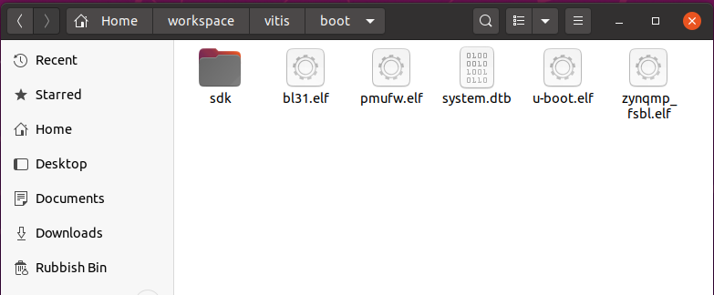
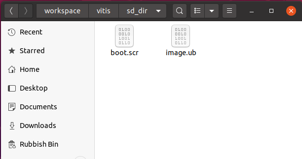
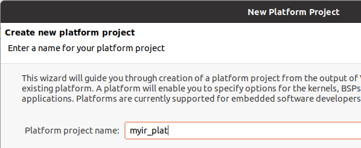
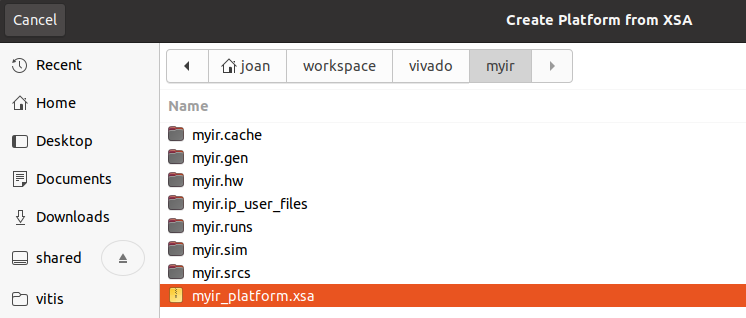
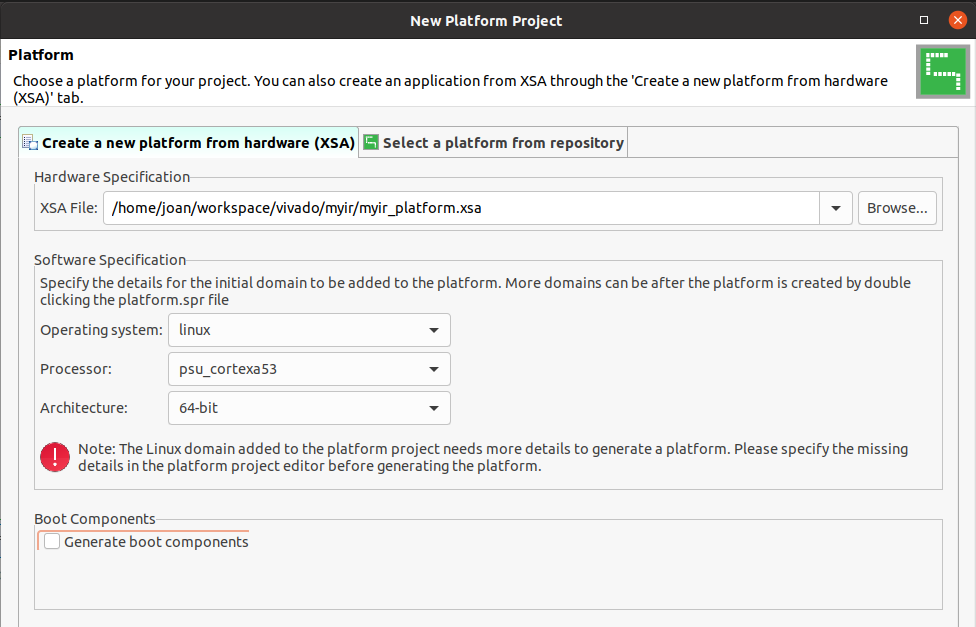
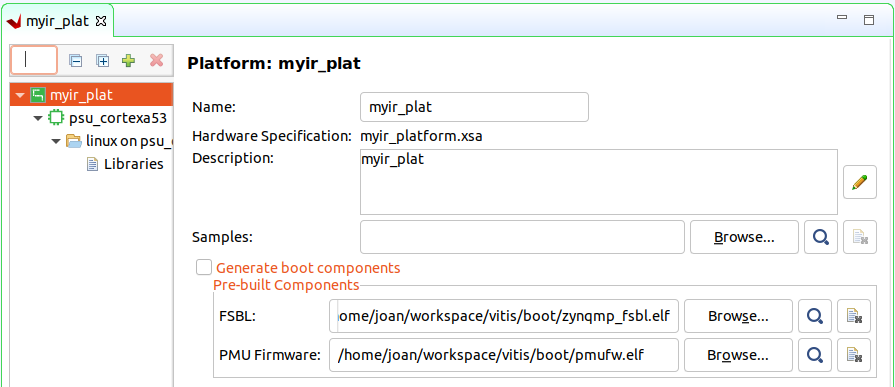

## Vitis accelerated flow application with the MYIR board
This is the third and last step of this tutorial. So for you have created the Vivado platform and bitstream in step 1 and the Linux elements (FSBL, kernel, image, root filesystem).

In this step we will create the Vitis platform, and build a Vitis application example that will run on the board.
```
Note: Xilinx tools 2021.2 have a bug and will fail if the year is 2022...
I fixed that by setting my VM not to update the date from the host and changing it to 2021
```
### Setting boot and sd card folders
In the `~/workspace/vitis` folder, create two folders, one for the boot files and root filesystem and another for the sd card:
```
cd ~/workspace/vitis
mkdir boot
mkdir sd_card
```
Now the sdk created in step 2 is to be expanded into the boot folder:
```
cd ~/workspace/petalinux/myir/images/linux/
./sdk.sh -y -d ~/workspace/vitis/boot/sdk
```
Copy the following files from `~/workspace/petalinux/myir/images/linux` into `~/workspace/vitis/boot`:
* bl31.elf
* pmufw.elf
* system.dtb
* u-boot-dtb.elf
* zynqmp_fsbl.elf

Rename `u-boot-dtb.elf` to `u-boot.elf` so it will end up like this.



Copy the following files from `~/workspace/petalinux/myir/images/linux` into `~/workspace/vitis/sd_card`:
* boot.scr
* image.ub



### Creating the Vitis platform
Start Vitis either with the desktop shortcut or via the terminal.
Click on **File->New->Platform** and enter the name for the platform, I chose myir_plat.



Next, browse for the XSA file, navigate to the `~/workspace/vivado/myir` folder and select it.



Next change the operating system to Linux, leave the other options and untick the boot file generation as we already have them created with Petalinux



In the platform settings the paths for the FSBL and PMU fw need to be entered, use those in the `vitis\boot` folder where we copied them from the Petalinux project.



Next the linux domain has to be configured as follows:
- For the **bif file**, click on the arrow and select **Generate bif file**
- For the **boot components directory**, select the `vitis/boot` folder created
- For the **linux rootfs**, browse to the `rootfs.ext4` file in the `images/linux` folder in the petalinux project
- For the **FAT32 partition directory**, select the sd_card folder we created
- For the **Sysroot directory**, select the `~/workspace/vitis/boot/sdk/sysroots/cortexa72-cortexa53-xilinx-linux` folder


